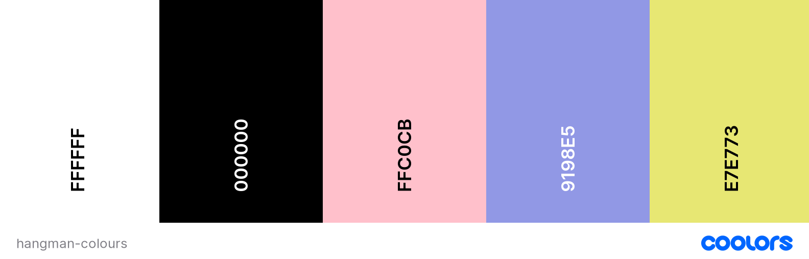
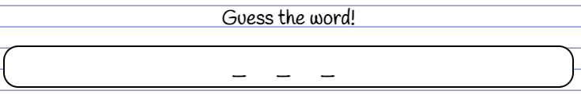

# Table Of Contents
- [Hangman Website Overview](#hangman-website-overview)
- [Responsive Review](#responsive-review)
- [User Experience (UX)](#user-experience-ux)
- [Further Development](#further-development)
- [Technologies Used](#technologies-used)
- [Testing](#testing)
- [Depolyment](#deployment)
- [Credits](#credits)

 

# Hangman Website Overview
   ## Live project [*(link to live project)*](https://joe-collins-1986.github.io/Hangman/)

   (**Note:** this is a fictitious client generated for the purpose of developing this project to test my HTML, CSS and javascript essentials.)
     
   This website has been designed to provide users with simple yet fun Hangman game to play when bored. It hs been created with a number of different topics whch can be accessed via the the settings section of the website.
     
   The client requesting this webite is using this as the first step in creating a site that will house a number of games and puzzles which he will later look to monitize through the use of advertisements.
      
___

# Responsive Review

   ## Am I Responsive? [*(link to repsonsive review website)*](https://ui.dev/amiresponsive?url=https://joe-collins-1986.github.io/Hangman/)
   
      
___

# User Experience (UX)

   

      
Website Objectives

    
   

      
Client Goals

   The wants a simple and engaging game that is easy to use and will result in users returing to the site. 
   * Sleek yet simple UX design.
   * Easy to use functionality.
   * Responsive for any device size to encourage mobile use as well as desktop use.
   * Links to the clients social network accounts to enhance their online presence.
   * Addictive gameplay to encourage return clients and drive positive word of mouth to encourage new users.
   

   ---

   

      
Client Future Goals

   
   Wishes which will later be developed to incorporate:
   * Additional words and topics to be added to the hangman game.
   * Allow for scores to be recorded and stored into a leaderboard.
   * Additional games and puzzles added to the site.
   * Generate advertisement revenue through the site.

   

   ---

   

      
First-Time Visitor Goals

   * Immediatly engaged by UX design.
   * Understand the purpose of the site.
   * Simple intuitive menu navigation.
   * Intuative contact form and links to social media.
   * Readable and asthetically pleasing on all devices.

   

   ---

   

      
Returning Visitor Goals

   
   * Revisit to replay game to try differnt topics.
   * Revisit to replay game to beat previous score.
   * Revisit to locate social media link to client.

   

   

   ---

      
Website Design

   
  

      
Colour Scheme

  Client wished the game to feel as though it was written on a piece of paper. Therefore main colours where kept simple with black and white.
   - Main colours: 
      - #000000 (Black)
      - #FFFFFF (White)

   To add a bit of simple colour to the main page margin lines gernerated through repeating linear gradients used some lighter colours found of papper note pads.
   - Margin lines on page:
      - #ffc0cb (Pink) (This colour will also to be used in for the required button hover animation to keep deisgn consitancy) 
      - #9198E5 (Maximum Blue Purple)

   To make sure the menu content stands out this will be set in a new colour. This will be set it a light yellow to mirror a post-it note
   - Menu colour:
      - #E7E773 (Straw) (This colour will be tweaked slightly using linear gradients to give a more real, 3d faded effect.) 

   

   

   ---

  

      
Typography

  For the typography the client wanted an easy to read text which looked handwritten. The ballance was to locate a font that gave this impression whilst still being clearly legible even on a small screen.
  - Font applied with backup options: 'Handlee', cursive, sans-serif

  

   ---

  

      
Imagery

  The images used for development of this website were taken from Unsplash and Font Awesome. These were selected to be minimalist and not detract from the main content wich was styled through CSS to meet the clients specifications.
   - Image for the backgound wood effect (jon-moore-5fIoyoKlz7A-unsplash.jpg).
   - Image of the mountain doodle which shows on large screen viewings (nicolas-pinilla-GcDr6ZIzbIw-unsplash.jpg).
   - Pins and paperclips where edited in photoshop from unsplash images.
   - the flavicon icon presented on the web tab was taken from Font Awesome (f43c).

   

   ---

   

      
Audio

   Audio was selected on this project to enhance the user experience but as per best practice guidelines was defaulted to mute> This can be toggled on via the settings menu.  
   The audio was selected from youtube clips which provided provided agreement for free usage. In several instances the audio clips where modified using Audacity to shorten them or remove background noise.
   - Backgound music (opted not to apply this as it was likely to become menotonous and there would have been licencing issues to obtaining engaging music tracks).
   - Sound on correct answer (https://www.youtube.com/watch?v=403gX7TnhTQ)
   - Sound on incorrect answer (https://www.youtube.com/watch?v=RZEsfS1rGyY) - modified using Audacity
   - Sound on getting word correct (https://www.youtube.com/watch?v=ytjxf9YNJ-0) - modified using Audacity
   - Sound on getting word correct (https://www.youtube.com/watch?v=na-a3lLB13Q&t=16s) - modified using Audacity

   

   

   ---

      
Structure Non-Linear Plane

 
The entire website will be housed on a single index page. The menu navigation, change of topics and win/lose outcomes will be facilitated through the use of javascript animating relevent sections.

---

      
Wireframes

 

- [Skeleton Plane](https://www.figma.com/file/a9GzO1BVIhSaGTQPYAINzx/hangman-wireframe-(Skeleton)?node-id=0%3A1)

- [Surface Plane](https://www.figma.com/file/9w1TswEvWfI4N8Fek3Gocf/hangman-wireframe?node-id=0%3A1)

**NOTE:** The structure and wireframes are only to act as a concept and are subject to change as the website development evolves in collaboration with the client.

---

      
Features

 

The above provides an inital mind map into what features might be appropriate for the website given the clients specifications.

### Features Breakdown

Each section below will detail their specific function. Code blocks used to detail how the function was applied will not include lines of code not relevent to the function being discussed. To view the code in full please review the JS file.
 

   
Ramdom Word

 

   #### Random word selected form list
   There will be 3 lists in this game:

    1. animals
    2. cars
    3. countries
   
   Dependant on the topic selected the reandom word will be taken form the appropriate list. 
   
   If the user selects play again the word will be removed from the list so that it can not be duplicated.
    

   ---

      
Present Word

 
   
   #### Empty Word
   At the commencement of the game there is a function to locate a random word from a list (dependent on topic selected) and present as underscores.

   
    

   ---

   #### Guessed Letter
   If the user's guess is in the randomly selected word the letter will appear as well as encouraging words on the screen.

   
    
   
   ---

   #### Guessed Incorrect Letter
   If the user's guess is not in the randomly selected word the underscore will remain as well words informing the user the answer is incorrect.
   
   It will also result in a hangman element being drawn and the potential winning score being reduced (this ill be explained in moore detail in the hangman and score functions section):

   
    
   
   ---
 

   
Select Letters

 

   #### Letters selected are checked against word
   The letter selected will be checked agaist the randomised word to see if it appears. If it does it will run success outcomes if it does not it will run fail outcomes. It will also update the presented word on the screen to incorporate correctly guessed letters.
    

   ---

   #### Letters fade after use
   After a letter is selected it will fade and be deaactivated.

   
    

   ---

   #### On game completion deactivate all letters
   After the game is won or lost no letter buttons will be active. This is to stop any further amendments tot he score.  
   The letters will not fade, they will just be deactivated.
    

   ---

 

 

   
Hangman Drawing

 

   #### Incorrect answers draw hangman element
   On incorrect guess a hangman element will be drawn. This is done using canvas in js.

   
    

   ---

   #### On game completion hangman section will be replaced with outcome
   The div holding the hangman image will also be used to detail if the user has won or lost on game completion.

   
    

   ---
   
    

   If reset is selected the webpage will refresh which will reset all variable and the game will start again at a score of 0.

   If play again is selected the required variable will be resent in js leaving the score to accumulate.
    

   ---

   
Rules

 

   #### Rules held on index page
   The rules content will be kept on the same page at the rest of the web content. This is to ensure the score is retained as backend data storage is not in use for this project.

   A scroll feature was added to the rules to post-it to keep the sizing consistant.

   
    

   
    

   ---

   
Settings

 

   #### Settings held on index page
   The settings content will be kept on the same page at the rest of the web content. This is to ensure the score is retained as backend data storage is not in use for this project.

   A scroll feature was added to the settings to post-it to keep the sizing consistant. This will only appear if required on small screens.

   
    

   ---

   #### Allow change in topic
   Within settings it will be possible to change the topic. This will change the list the randomised word is selected from and will also present the currents topic onto the html page.

   (See screenshot above)
    

   ---

   #### Allow change in topic
   Within settings it will be possible to toggle the audio on and off. As per best practice this will be set to mute as default.

   (See screenshot above)
    

   ---

   
Score

 

   #### Score increase
   Set to increase the score dependant on how many incorrect answers the user makes.

   Potential score starts at 10 each game and reduces by 1 for each incorrect letter guessed.

   
    

   ---

   #### Score decrease
   If the user does not guess the word in 10 attempts then their score will reduce by 5 points. This has the potential to take the users overall score into a negative figure.

   
    

   ---

   #### Score accumulation
   If the user opts to play again their score will be retained from the previous games witht he new score being added.

   
    

   ---

   
Social Media Links

 

   #### Present links to social media platforms
   The links provided will take the user to the social media platforms but not to active accounts. This is because the client is fictional and does not have real accounts.

   

   

---

# Further Development
* Add additonal catagories to the hangman game.
* Use web-scrapping to generate full word lists for future catagories.
* Add optional timer to game.
* Provide language options to game.
* Retain scores using back-end development to provide a scoreboard for users.
* Add additional games.
* Add advertisements to site to generate revenue.
   

# Technologies Used

      
Languages Used

   - HTML
   - CSS
   - JavaScript

   ___

      
Frameworks, Libraries & Programs Used

   1. Google Fonts:
   - Used to obtain appropriate fonts to use in website not held as standard.
   2. Font Awesome:
   - Used to obtain several icons used to improve the visuals of the website.
   3. Git:
   - Used for version control and to Push to GitHub.
   4. GitHub:
   - Used to store and share the code as well as publish to live website.
   6. Figma:
   - Used to plan out website format.
   7. Web Developer:
      - Used to analyse HTML, CSS and JavaScript output and correct where required.
   8. Canvas:
      - Used to draw the hangman on js.
   
   ___

   

# Testing
 ## HTML Validator Results: 
   - [HTML index page](https://validator.w3.org/nu/?showsource=yes&doc=https%3A%2F%2Fjoe-collins-1986.github.io%2FHangman%2F)

 ## CSS Validator Results
   - [CSS validator results](https://jigsaw.w3.org/css-validator/validator?uri=https%3A%2F%2Fjoe-collins-1986.github.io%2Fmuscle-map%2F&profile=css3svg&usermedium=all&warning=1&vextwarning=&lang=en)

 ## Lighthouse Accessibility Results:

   - [Home](assets/readme-assets/3.testing/home-sum.png)

## Testing User Stories from User Experience (UX) Section
#### **Client Goals**
   1. Develop brand recognition for his logo and brand colours.
      * **REVIEW - Colours provided by the client used consistently and extensively throughout website.**
   2. Set up a website to generate traffic which will:
      - drive additional gym attendance.
         * **REVIEW - Provides location of the gym to drive traffic.**
      - provide a contact for his personal training.
         * **REVIEW - Provides form to contact personal trainer (only managing front end requirements).**
   3. Engage with new and first-time gym-goers by providing a simple breakdown of which exercises target each muscle. 
      * **REVIEW - Each muscle split into its own page with a clear breakdown of exercises to target it.**
   4. Engage with new and first-time gym-goers by providing a breakdown of the differences between compound exercises and isolation exercises with a link to further reading.
      * **REVIEW - Link to external source explaining the differences. Used external website section ID to direct user to relevant paragraph.**
   5. Link exercises to YouTube instruction videos. (This will later be replaced with videos the client will generate personally.
      * **REVIEW - Links to YouTube set up for each exercise. Client specified which YouTuber they wished to reference.**

#### **First-Time Visitor Goals**
   1. Acknowledge clear and memorable branding.
      * **REVIEW - Muscle Map logo clearly visable in the top left.**
      * **REVIEW - Colours provided by the client used consistently and extensively throughout website.**
   2. Understand the purpose of the site.
      * **REVIEW - Hero image gives clear indication this site is dedicated to exercise.**
      * **REVIEW - Hero text appears to user instantly and references the website as a training companion.**
   3. Simple intuitive navigation.
      * **REVIEW - Clear navigation bar at the top of the page.**
      * **REVIEW - Navigation bar reduces to hamburger icon for smaller screens to ensure information is presented clearly.** 
      * **REVIEW - Logo at the top left corner always redirects the user back to the home page.**
   4. Easy access to external links provided on the website.
      * **REVIEW - External links open on a click and open a separate page.**
      * **REVIEW - Each link has an aria-label to detail what the link is and that it will open in a separate tab.**
   5. Intuative  contact form and links to social media.
      * **REVIEW - Social media links clearly detailed in the footer, which is set to a fixed position to always be visible.**
      * **REVIEW - Contact Form located on its own page with clear labelling of inputs.**
   6. Receive gym location.
      * **REVIEW - Location provided in the form of Google Maps at the bottom of the contact page.**
   7. Gain a basic understanding of the exercises demonstrated and how and why they are used.
      * **REVIEW - Each exercise detailed has an accompanying tutorial video to detail correct form and exercise benefit.**
   8. Readable and asthetically pleasing on all devices.
      * **REVIEW - Media queries used to ensure each page is responsive to all devices.**

#### **Returning Visitor Goals**
   1. Revisit to access instructional links.
      * **REVIEW - Links provide a useful repository for users to keep them comming back to the site.**
   2. Revisit to access social media links.
      * **REVIEW - Opportunity for users to come back to locate the social media links.**
   3. Revisit to create or update training plan.
      * **REVIEW - Plan is set up in a way to be re-usable to encourage users to return.**
   4. Revisit to request personal training after being introduced to the fundamentals.
      * **REVIEW - After getting what they can from the website and building a foundation, the website encourages users to continue their development by contacting a personal trainer.**
   5. Revisit to locate gym.
      * **REVIEW - Gym location is detailed as part of the contact page.**

## Further Testing
* Tested across Google Chrome, Safari, Microsoft Edge, Fire Fox browsers on both Mac and Windows.
* Viewed on a variety of devices using Web Developer Tools as well as several live desktop, iPad and mobile devices. 
* Each page tested by developer and friends to ensure functionality worked as expected.
* Issued to Slack community to review and feedback on.

   
Bugs

    

   

      
HTML

   ### Warnings
   Following the HTML validation the following warnings were identified and addressed.

   

   #### **Resolutions**
   **Points 1 - 2:**
   These were initially implemented as li items acting a menu option directing to additional content. However, removed aria-label following best practice due to no href.

   **Points 3 - 7:**
   All ID first occurrences were addressed by changing duplicate IDs to classes.

   **Points 8:**
   Placed empty quotes into h2 space to remove error. This header is produced by js.

   ### Errors
   Following the HTML validation the following errors were identified and addressed.

   

   #### **Resolutions**
   **Point 1:**
   Delete stray div tag.

   **Points 2 - 6:**
   - Replace IDs with Classes and update CSS to .element as opposed to #element.
   - Checked ID was not used in js.
   - Removed duplicate class syntax e.g .class="settings-pin" class="pin-right". This was changed to class=”settings-pin pin-right”.

   **Points 7 - 10:**
   Mute is defaulted as true so no need to specify. Therefore reomoved = “true”.

   ### Development Bugs

   

## Key Learns
* On following projects I will look to be more efficient in my use of CSS. In this project I styled each element as I needed them which caused a lot of duplication and redundant code. By defining the key classes and body formats I need across the entire project up front I will be able to optimise my code.
* In future projects I will aim to move away form the heavy use of pixels and instead primarily utilise rem (and in some specific circumstances em). This will provide more control over responsive design.
* In this project I developed media queries as and when i required them. As a result, I built them directly into the body of the CSS code alongside the elements they impacted. My Mentor advised that it would be best practice to consolidate these at the end of the CSS page. This would reduce line requirements by placing all media queries within a singular max-width media query appropriate to them. However due to the way I built and structured this project it would make the code difficult to read and locate so I have opted to leave this project as is for the sake of clarity but apply a more structured approach to my next project.
* On the Plan page, I made the cards responsive by converting from flex direction rows to columns and updating the margins so it showed correctly on a smaller screen. This was done as originally I had 3 cards when I built the functionality, however had I known at the point of build that I would only use 2 cards I would have used flex-grow and flex wrap instead for a more concise and efficient code. This was not an appropriate option for more that 2 cards as it would have shown them with varied widths when pushed onto the next line.

# Deployment
## Set up Local GitHub Repository
1. Go to https://github.com/Code-Institute-Org/gitpod-full-template.
2. Select use this template.
3. Add repository name within my GitHub. (This will generate a repository in my Git Hub with the appropriate files.)

## Repository Framework
1. Select the repository on GitHub and open with Gitpod (green button).
2. Create required html page.
3. Create assets folder.
4. Within assets folder create css folder, images folder, js folder & readme-assets folder.
5. Add required files to folders including style.css, images, script.js, etc.

## Update Repository
1. When adding a new feature create a separate branch to work in safely typing into the terminal "git branch 'name of required feature/update'".
2. Checkout the branch with "git checkout 'name of required feature/update'".
3. Make updates and test using "python -m http.server".
4. Once testing is complete add to Git staging area using "git add ."
5. Commit the changes and add a useful explanation of what action was done to track the history in GitHub using "git commit -m 'explanation of update'".
6. Once the feature is complete, fully tested, and ready to be added to the main branch first go to the main branch using "git checkout main".
7. Merge the feature branch into the main using "git merge 'name of required feature/update'".
8. Confirm merge was successful and then if it is not going to be re-used delete the feature branch using "git branch -d 'name of required feature/update'". (if deleting a branch with commits not merged to main delete with -D instead of -d)
9. Use "git push" to push the commits to GitHub. These will then appear in the live website if it has been set up in GitHub Pages.

## GitHub Pages
Deploy in GitHub Pages:
1. Log in to my GitHub and go to my appropriate repository.
2. Access settings.
3. Under 'Code and Automation' go to pages.
4. Leave the source as Deploy from Branch.
5. Set Branch to Main.
6. Save.
7. Give GitHub a few minutes and the live URL is provided at the top of the GutHub Pages section of settings.
8. Any Git Pushes from the terminal whilst working on the repository using Gitpod will now update in this live site.

# Credits
## Content
* Hamburger responsive nav-bar – Web Dev Simplified - https://www.youtube.com/watch?v=At4B7A4GOPg
* Outline border on call-to-action text - https://www.w3schools.com/css/css3_shadows.asp
* Structure of README.MD file - https://github.com/emilija-smitaite/milestone-project-1/blob/main/README.md

## Media 
* All images were obtained from Unsplash.
* Videos were all from Youtube - ScottHermanFitness
* Links to external websites
   - https://8fit.com/fitness/compound-vs-isolation-exercises-benefits-and-differences/#what-are-isolation-exercises
   - https://www.verywellfit.com/abdominal-muscles-anatomy-3120072#mntl-sc-block_1-0-6
   - https://en.wikipedia.org/
* Excerpts from external links  
   - https://www.verywellhealth.com/
   - https://my.clevelandclinic.org/

## Acknowledgements
* Thank to my Mentor (Spencer Barriball) for his feedback and guidance.
* The Code Institute Slack community for helping with any and all queries.
